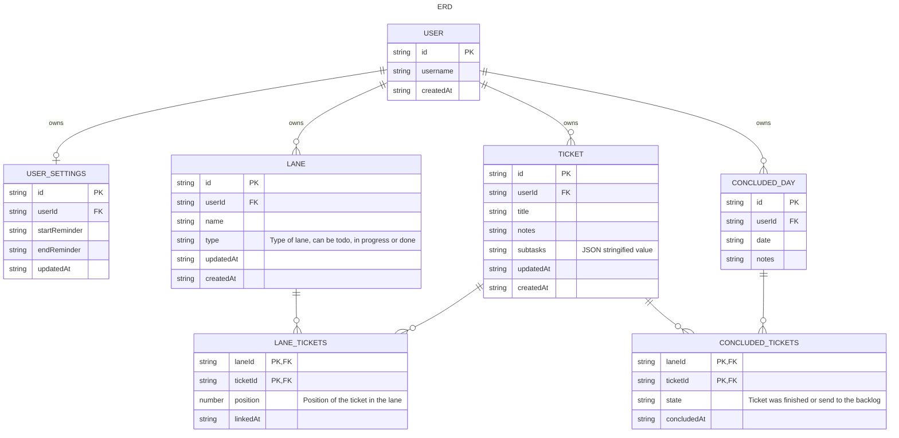

```mermaid
---
title: ERD
---
erDiagram
  USER {
    string id PK

    string username
    string createdAt
  }

  USER_SETTINGS {
    string id PK
    string userId FK

    string startReminder
    string endReminder

    string updatedAt
  }

  LANE {
    string id PK
    string userId FK

    string name
    string type "Type of lane, can be todo, in progress or done"

    string updatedAt
    string createdAt
  }

  LANE_TICKETS {
    string laneId PK, FK
    string ticketId PK, FK

    number position "Position of the ticket in the lane"

    string linkedAt
  }

  TICKET {
    string id PK
    string userId FK

    string title
    string notes
    string subtasks "JSON stringified value"

    string updatedAt
    string createdAt
  }

  CONCLUDED_DAY {
    string id PK
    string userId FK

    string date
    string notes
  }

  CONCLUDED_TICKETS {
    string laneId PK, FK
    string ticketId PK, FK

    string state "Ticket was finished or send to the backlog"

    string concludedAt
  }

  USER ||--o| USER_SETTINGS : "owns"
  USER ||--o{ LANE : "owns"
  USER ||--o{ TICKET : "owns"
  USER ||--o{ CONCLUDED_DAY : "owns"

  LANE ||--o{ LANE_TICKETS : ""
  TICKET ||--o{ LANE_TICKETS : ""

  CONCLUDED_DAY ||--o{ CONCLUDED_TICKETS : ""
  TICKET ||--o{ CONCLUDED_TICKETS : ""
```
